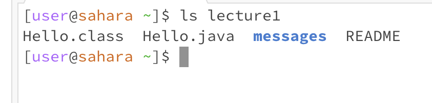

# cd
## no arguments

The working directory is home.
cd goes into a directory if it is in the current working directory. Because there was no argument, there was nothing to go into, so nothing happened.
The ouput is not an error
## directory as argument

The working directory is home.
cd goes into a directory if it is in the current working directory, so the current working directory changed to lecture1, the argument.
The ouput is not an error
## file as argument

The working directory is lecture1. 
cd goes into a directory if it is in the current working directory, but the argument was a file so nothing happened.
The ouput is not an error
# ls
## no arguments

The working directory is home.
ls lists all the files and directories inside the current one, so all the files and directories are listed.
The output is not an error. 
## directory as argument

The working directory is home.
ls lists all the files and directories inside the given one, so all the files and directories are inside the argument are listed.
The output is not an error.
## file as argument

The working directory is lecture1.
ls prints out the name of the file in the argument. 
The output is not an error.
# cat
## no arguments

The working directory is home.
cat prints out whatever you type afterwards.  
The output is not an error.
## directory as argument

The working directory is home.
cat prints out the name of the directory in the file and that it is a directory.   
The output is not an error.
## file as argument

The working directory is lecture1.
cat prints out the contents of the file in the argument.
The output is not an error.
