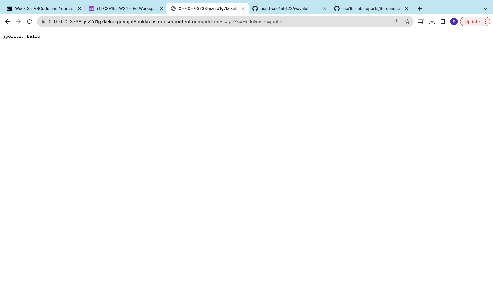

# Part 1
## Chat Server Code

## Website Screenshot 1

The methods called were `url.getPath()`, `.contains()`, `.substring()`, `.indexOf()`
The relevant arguments were parts of the message in the url to split, to get the indexes of the user and the message. 
The index of the user and message change depending on the length of each in the message in the url. 

## Website Screenshot 2

The methods called were `url.getPath()`, `.contains()`, `.substring()`, `.indexOf()`
The relevant arguments were parts of the message in the url to split, to get the indexes of the user and the message. 
The index of the user and message change depending on the length of each in the message in the url. 

# Part 3
I learned how to create a chat server, and the code behind how to make different things appear based on the url. I learned about ports and remote servers and cloning repositories. 
