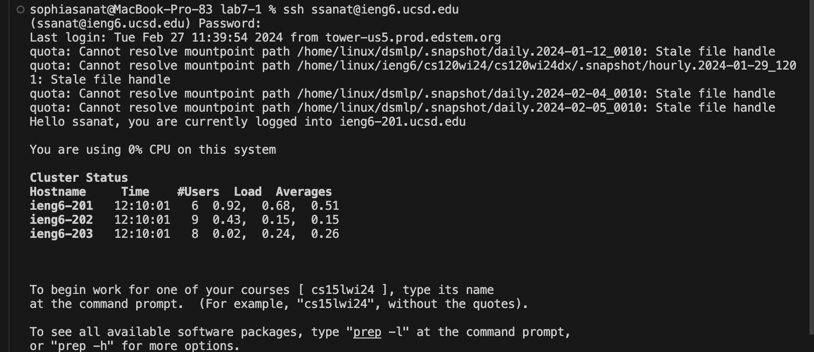
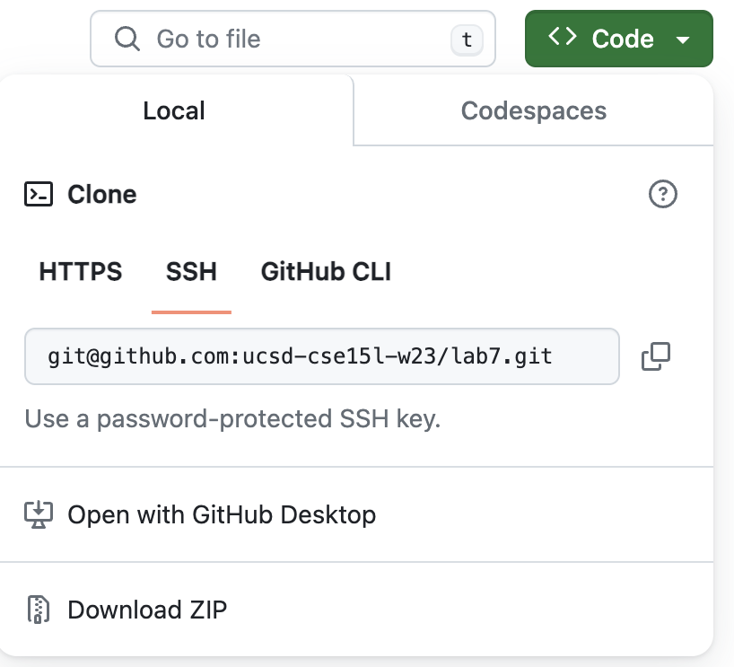
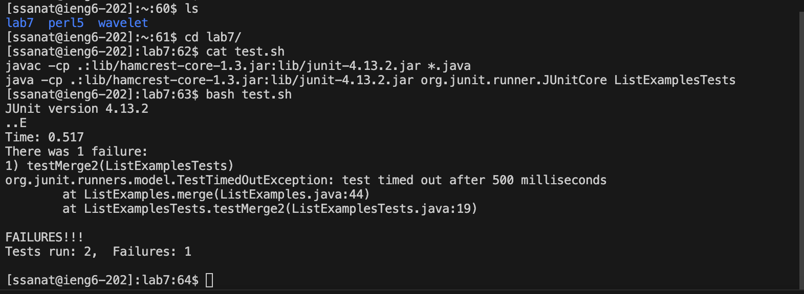
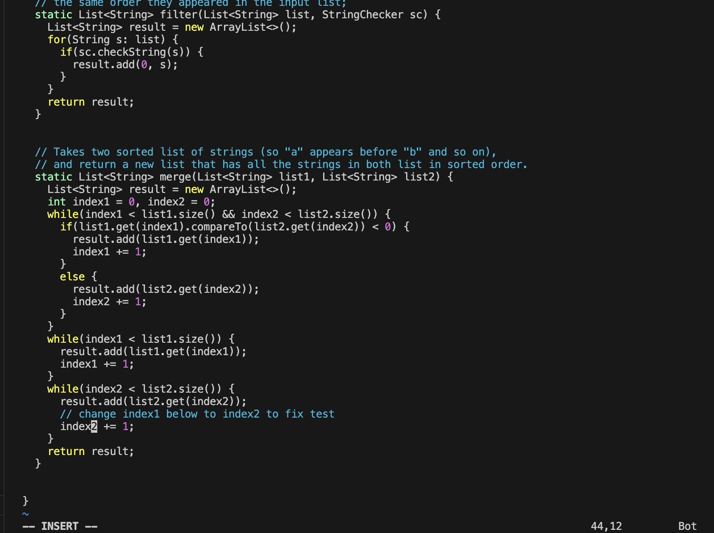
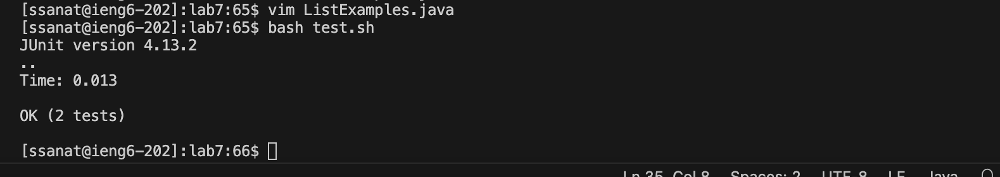
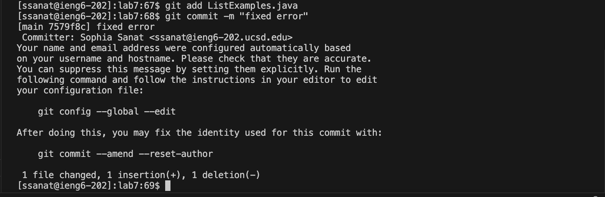

## Step 4: Log into ieng6
Keys pressed: `ssh ssanat@ieng6.ucsd.edu<enter>`and then entered my password.
I didn't have any commands in my search history so I had to type out the whole command.

## Step 5: Clone your fork of the repository from your Github account (using the SSH URL)
I copied the ssh url and pasted it into VS Code to clone it.

## Step 6: Run the tests, demonstrating that they fail
Keys pressed: `ls<enter> cd<space>l<tab><enter> cat<space>test.sh<enter> bash<space>t<tab><enter>
I entered cd l<tab> because it autofilled to cd lab7. Then I entered cat test.sh just to see what test.sh would run.  
Then I entered bash t<tab> because it autofilled to bash test.sh to actually run the tests.

## Step 7: Edit the code file to fix the failing test
Keys pressed: `vim<space>L<tab>.java<enter> jjjjjjjllllllllllxi2<esc> :wq<space><enter>`
L<tab> autofilled to ListExamples and I typed .java, to edit the ListExamples.java file. I pressed j and l a lot of times to go down and then right. I pressed x to delete 1 from index 1, and then i and 2 to insert 2, esc to go to normal mode and then :wq<space><enter> to save the changes and stop editing. 

## Step 8: Run the tests, demonstrating that they now succeed
Keys pressed: `<up><up><enter>
The command bash test.sh was two up in my history so I used the up arrow to access it. 

## Step 9: Commit and push the resulting change to your Github account 
Keys pressed `git<space>add<tab><tab><enter> git<space>commit<space>-m<space>"fixed<space>error"<enter>
I preddef tab twice to autofill to ListExamples.java, then I typed out the whole commit command and message.

