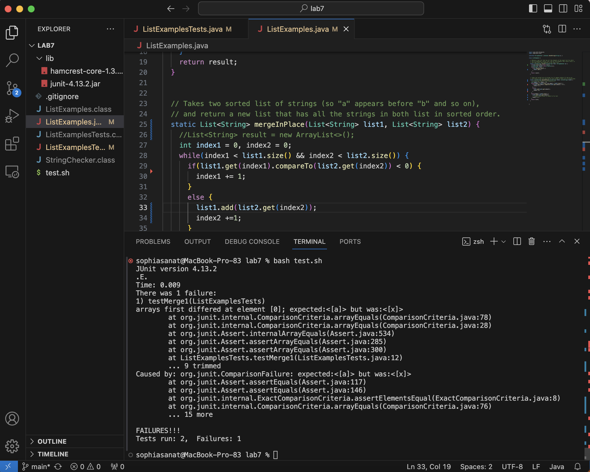
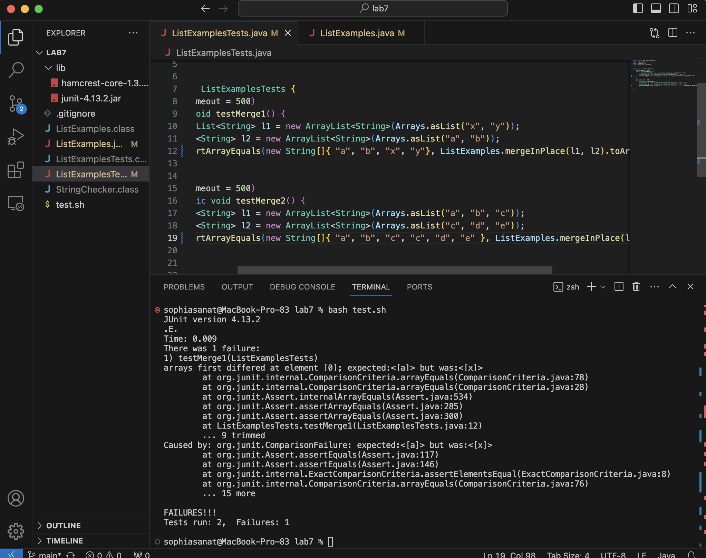
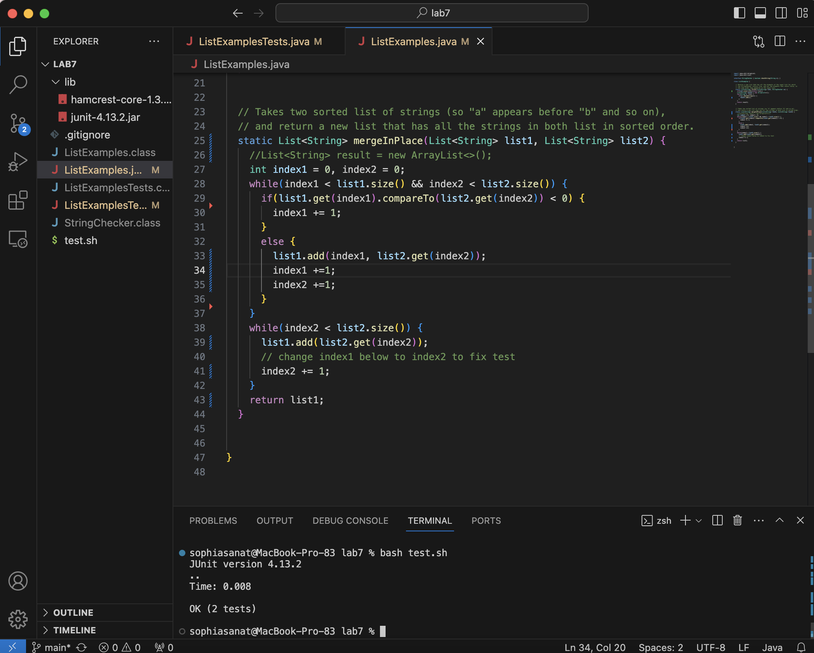
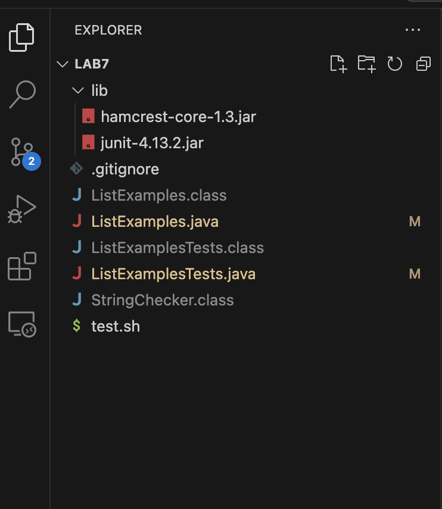
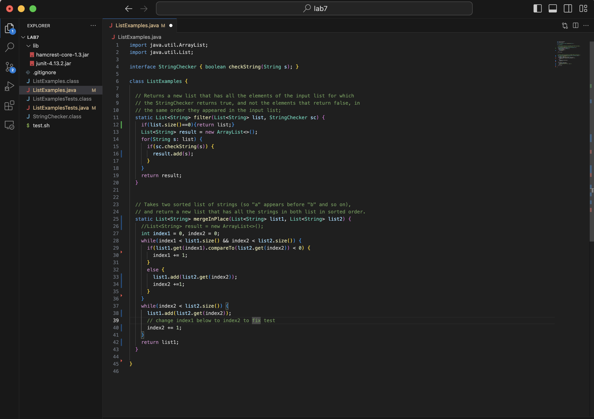
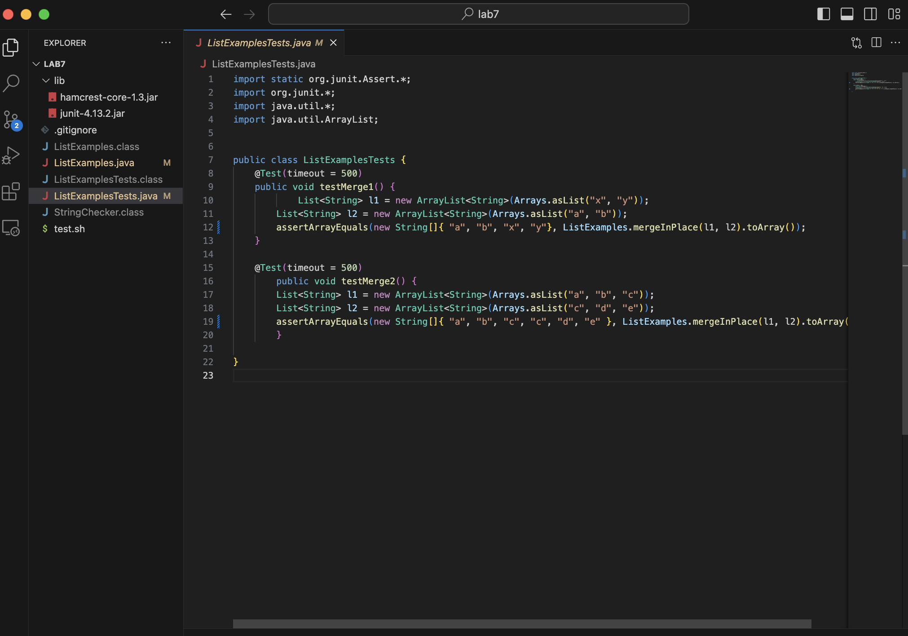

#Part 1 -Debugging Scenario

##EdStem post from student:  

This symptom is that the array has a different output than was expected. The failure inducing input is two longer arrays that have one of the same element.   

##Response from TA
It looks like the array elements are not being added in the right order. Maybe you could try checking wether index1 and index2 are increasing in the right way?

##Another Screenshot

The bug was that index1 was not increasing when an element from list2 was added, and that the element was being added at the end.

##Information about the setup  
File structure: 

Contents of each file:

Command line:  
Ran `bash test.sh`  which runs 
`javac -cp .:lib/hamcrest-core-1.3.jar:lib/junit-4.13.2.jar *.java`  
`java -cp .:lib/hamcrest-core-1.3.jar:lib/junit-4.13.2.jar org.junit.runner.JUnitCore ListExamplesTests`  
What to edit:
At line 33 in ListExamples.java, edit `list1.add(list2.get(index2))` to be `list1.add(index1, list2.get(index2))`
And and an extra line at line 34 with `index1 = index1 +1`

#Part 2 -Reflection  
Something I learned in the second half of this quarter was using the jdb Debugger.
I thought this was really cool because I can imagine that if you have a code that's really long with a lot of variables it would make finding the bug way easier. 
